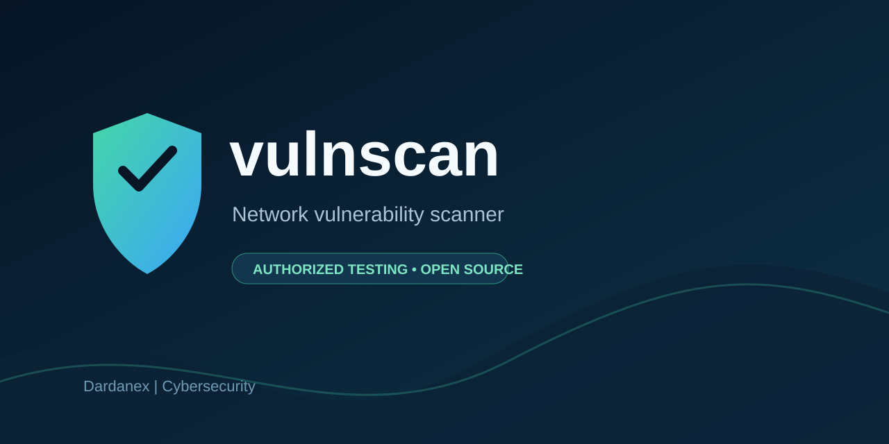
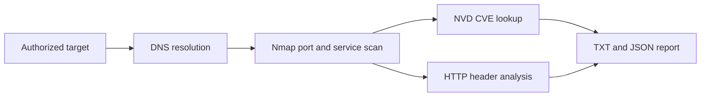

<p align="center">
  
</p>

<h1 align="center">vulnscan</h1>

<p align="center">A permission-gated network vulnerability scanner for authorized security testing and education.</p>

<p align="center">
  <a href="https://www.python.org/"></a>
  <a href="LICENSE"></a>
  
  <a href="https://nmap.org/"></a>
  <a href="CONTRIBUTING.md"></a>
</p>

<p align="center">
  <a href="#features">Features</a> •
  <a href="#installation">Installation</a> •
  <a href="#usage">Usage</a> •
  <a href="#example-output">Example Output</a> •
  <a href="#roadmap">Roadmap</a> •
  <a href="#author">Author</a>
</p>

## Why vulnscan

vulnscan brings foundational reconnaissance, service discovery, CVE research, and HTTP header review into one clear command-line workflow. It is designed to make authorized assessments easier to document while keeping permission confirmation and safe input handling visible from the start. Results are written in both human-readable and machine-readable formats for follow-up work.

## Features

| Feature | Description |
| --- | --- |
| 🔎 DNS reconnaissance | Resolves IPv4 and IPv6 addresses and performs best-effort reverse DNS lookups. |
| 🔌 Nmap service discovery | Scans the top 100, top 1,000, or all TCP ports with service and version detection. |
| 🧩 NVD CVE research | Queries the NIST NVD API v2 for detected product/version keywords with caching and rate limiting. |
| 🛡️ HTTP header review | Checks common response security headers, reports disclosure headers, and assigns an A–F grade. |
| 📝 Practical reports | Exports branded TXT and JSON reports with severity summaries. |
| ✅ Permission first | Requires explicit authorization in non-interactive sessions and validates target input. |

## Demo

<p align="center">
  
</p>

<details>
<summary><strong>View sample TXT report</strong></summary>

```text
VULNSCAN REPORT
============================================================
Target: scanme.nmap.org
Timestamp: 2026-10-03T12:00:00+00:00

DNS
---
IPv4: 45.33.32.156
IPv6: None

OPEN PORTS
----------
45.33.32.156 22/tcp  ssh OpenSSH 6.6.1p1
45.33.32.156 80/tcp  http Apache httpd 2.4

CVES
----
Apache httpd 2.4:
  CVE-2024-0001 [HIGH 8.1] 2024-01-01

HTTP SECURITY HEADERS
---------------------
http://scanme.nmap.org/: C
  Content-Security-Policy: missing — Deploy a restrictive Content-Security-Policy.

SUMMARY
-------
Open ports: 2
Critical CVEs: 0
High CVEs: 1
Medium CVEs: 0
Low CVEs: 0

------------------------------------------------------------
Generated by vulnscan v1.0.0 | Shpetim / Dardanex | https://www.dardanex.com
```

</details>

## Installation

Clone the repository first:

```bash
git clone https://github.com/Shpetim12/dardanex-vulnscan.git
cd dardanex-vulnscan
```

### Windows

1. Install [Nmap for Windows](https://nmap.org/download) and ensure it is available on `PATH`. vulnscan also checks the standard Nmap installation directories.
2. Create and activate a virtual environment, then install the project:

```powershell
py -m venv .venv
.venv\Scripts\Activate.ps1
pip install .
```

### Linux

1. Install Nmap: `sudo apt install nmap`
2. Create and activate a virtual environment, then install the project:

```bash
python3 -m venv .venv
source .venv/bin/activate
pip install .
```

### macOS

1. Install Nmap with Homebrew: `brew install nmap`
2. Create and activate a virtual environment, then install the project:

```bash
python3 -m venv .venv
source .venv/bin/activate
pip install .
```

For development and tests, use `pip install -r requirements.txt`.

To raise the NVD request allowance, set an API key issued by NVD:

```bash
# PowerShell: $env:NVD_API_KEY = "your-key"
# Linux/macOS: export NVD_API_KEY="your-key"
```

## Usage

The `--i-have-permission` flag is required in non-interactive sessions. In an interactive terminal, vulnscan asks for confirmation.

| Flag | Description | Default |
| --- | --- | --- |
| `target` | Authorized hostname or IP address to assess. | Required |
| `--scan` | Port-scan scope: `quick`, `default`, or `full`. | `default` |
| `--format` | Report format: `txt`, `json`, or `both`. | `both` |
| `--output-dir` | Directory for reports and the NVD cache. | `reports` |
| `--no-cve` | Skip NVD CVE research. | Off |
| `--no-headers` | Skip HTTP security-header analysis. | Off |
| `--timeout` | Network timeout in seconds. | `10.0` |
| `--i-have-permission` | Confirms that you are authorized to scan the target. | Off |
| `-v`, `--verbose` | Enable diagnostic logging. | Off |
| `--version` | Print version and project attribution. | — |

```bash
# Check the installed version
vulnscan --version

# Fast, authorized assessment of Nmap's public demo target
vulnscan scanme.nmap.org --scan quick --format both --i-have-permission

# Skip external CVE searches for a faster local assessment
vulnscan example.org --scan default --no-cve --i-have-permission

# Full TCP scan with custom report location and timeout
vulnscan 192.0.2.10 --scan full --output-dir reports --timeout 15 --i-have-permission
```

`scanme.nmap.org` is Nmap's publicly permitted demonstration target. Do not scan systems outside your approved scope.

## How it works



## Project structure

```text
vulnscan/
├── vulnscan.py                 # CLI entry point and permission gate
├── pyproject.toml              # Installable package metadata and console script
├── requirements.txt            # Runtime and test dependencies
├── scanner/
│   ├── __init__.py             # Package metadata and shared exports
│   ├── dns_resolver.py         # Target validation and DNS reconnaissance
│   ├── port_scanner.py         # Nmap discovery and service scanning
│   ├── cve_lookup.py           # NIST NVD API v2 client and cache
│   ├── header_analyzer.py      # HTTP security-header analysis
│   └── report.py               # TXT and JSON report generation
├── reports/                    # Generated reports; ignored by Git
├── docs/                       # README banner and demo images
├── tests/                      # Unit tests with mocked network calls
├── CONTRIBUTING.md             # Contribution guide
├── SECURITY.md                 # Security reporting policy
├── CHANGELOG.md                # Release history
└── LICENSE                     # MIT License
```

## Roadmap

- [x] Permission-gated DNS reconnaissance and Nmap service discovery
- [x] NVD CVE lookup with caching, rate limiting, and retries
- [x] HTTP security-header analysis and TXT/JSON reports
- [x] Installable Python package and cross-platform Nmap discovery
- [ ] CPE-based CVE matching with confidence indicators
- [ ] Configurable authenticated web checks
- [ ] SARIF output and report templates
- [ ] TLS configuration analysis

## Legal disclaimer

> [!WARNING]
> vulnscan is for authorized security testing and education only. Obtain explicit permission before scanning any system. The author and Dardanex accept no liability for misuse, unauthorized access, service disruption, data loss, or legal consequences.

## Contributing

Contributions are welcome. Read [CONTRIBUTING.md](CONTRIBUTING.md), keep pull requests focused, add tests for behavior changes, and never include credentials or unauthorized scan output.

## Security

To report a vulnerability in vulnscan itself, do not open a public issue. Follow the private reporting guidance in [SECURITY.md](SECURITY.md).

## License

Copyright (c) 2026 Shpetim / Dardanex. Released under the [MIT License](LICENSE).

## Acknowledgements

vulnscan is built with and informed by [Nmap](https://nmap.org/), [python-nmap](https://xael.org/pages/python-nmap-en.html), the [NIST NVD API](https://nvd.nist.gov/developers/vulnerabilities), [Rich](https://github.com/Textualize/rich), and [Requests](https://requests.readthedocs.io/).

## Author

- **Shpetim** — Dardanex, Kosovo
- Dardanex: web development, cybersecurity, and digital marketing
- Website: [www.dardanex.com](https://www.dardanex.com)
- GitHub: [github.com/Shpetim12](https://github.com/Shpetim12)
- Contact: [info@dardanex.com](mailto:info@dardanex.com)
